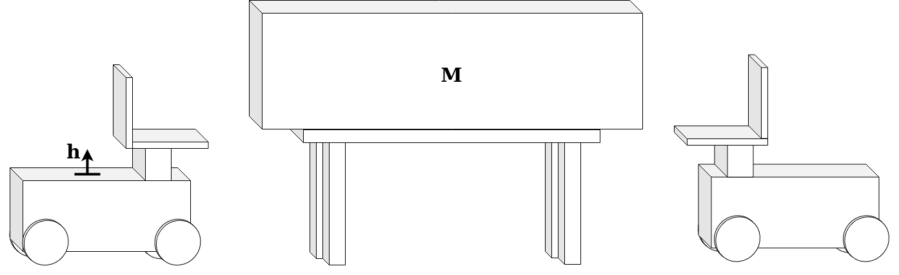
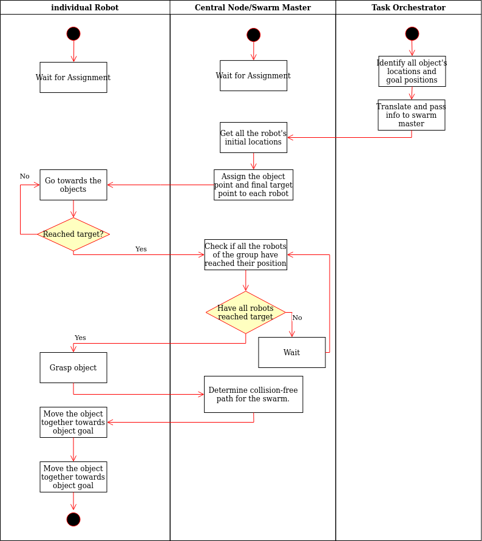
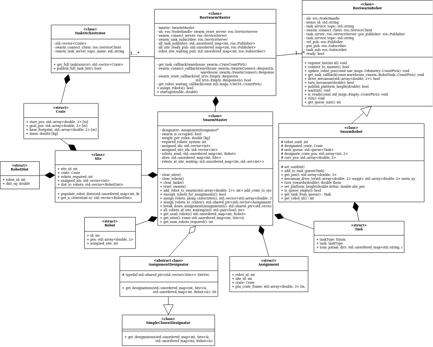
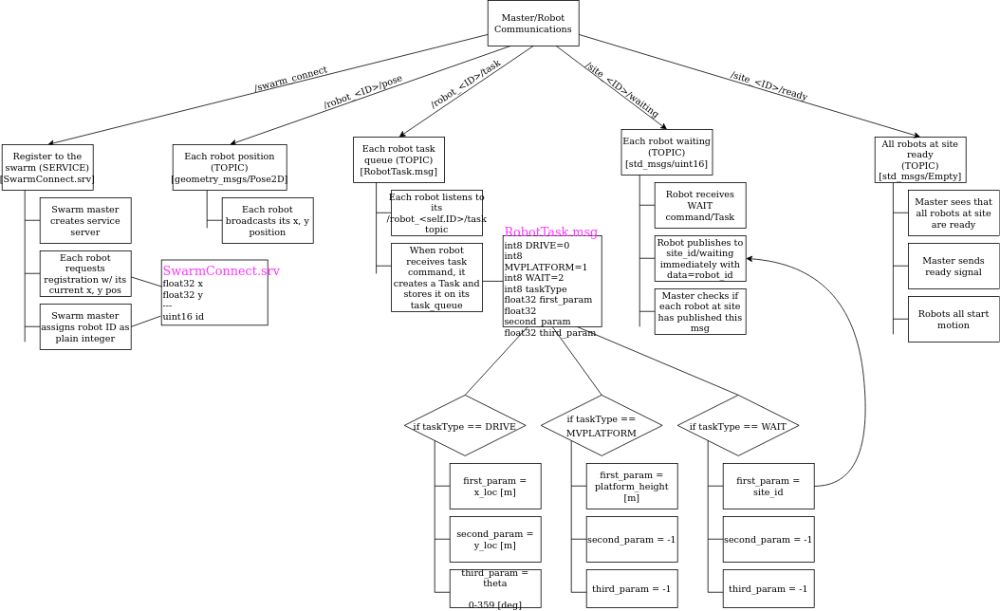

# Swarm-Automation-for-Warehouses

## Packages and Dependencies
This project is developed and tested on ROS Neotic and Melodic, The project is developed using C++ langauge.
We use ROS packages such as TF, roscpp, std_msgs, geometry_msgs,message_runtime

## Overview

The aim of the project is to implement a solution for automation of warehouses using robot swarms. In our proposed system, a group of robots closer to the target object, coordinate with each other based on the relative positions to the target object and group together to pick the object and deliver it to the object's goal position.

The following assumptions are made while developing this project :-

  1. Individual robot in the swarm can bear the given load and carry it to the respective target.
  2. Terrain and map of the warehouse is known to the swarm master.
  3. The communication between the robots happens without any breaks and the position broadcast by the robot is accurate to $10^{-1}$ units.
  4. There will be no failure in the in the pickup process and we expect the robots will carry the object all the way to the object's location.
  5. Clearance of 1 unit from any obstacle.
  6. No slippage between the wheel and motor shaft and the whole system will have the same RPM.
  7. The a heavier object will have a size that is wide enough to accommodate the required number of robots to lift it.


 Our idea to lift a crate is
 

## Steps to install and launch the simulation
  Install and build the dependencies:  
  ```
  source <path_to_ws>/devel/setup.bash
  cd <path_to_ws>/src
  git clone https://github.com/Rishabh96M/nexus_4wd_mecanum_simulator.git
  cd <path_to_ws>
  catkin_make
  ```

  Clone the swarm repository :
  ```
  source <path_to_ws>/devel/setup.bash
  cd <path_to_ws>/src
  git clone https://github.com/PrannoyNamala/Swarm-Automation-for-Warehouses.git
  cd <path_to_ws>
  catkin_make
  ```

  To launch and run the simulation :
  ```
  source <path_to_ws>/devel/setup.bash
  roslaunch warehouse_swarm simulation.launch
  ```
  This will launch 20 nexus robots with a platform to lift the payload on to the swarm world. Move the robots to the payload and perform the required action

## To run the unit tests and gtest
  ```
  cd <path_to_ws>/
  catkin_make run_tests_warehouse_swarm
  catkin_make run_tests_warehouse_swarm_gtest
  ```
## Agile Iterative Process (AIP)
This project will be completed using AIP with the involvement of 3 programmers using Pair-programming with a design keeper in turns. The detailed Product Backlog, Iteration Backlogs and Work Log are mentioned in the link given below :

[Agile Iterative Process](https://docs.google.com/spreadsheets/d/1AiBJ7fTTMpNdjacxr-WVjDRh2hcvcvK_cOTTBANr-Ac/edit#gid=0)

[Google Doc Link forDesign and Planning notes](https://docs.google.com/document/d/1R9V4Kxqv8dNjsHtDVxABXgzMm4t1GjswrSu_oFk5m9A/edit?usp=sharing)

The initial activity diagram is here below


The initial UML is here below


The final UML is here below


Our Communications is here below


## Checking the information of bag file
The Rosbag in in the **results** folder, To check the information of the bag file, run the following command in the location where bag file is saved:
```
rosbag info rosbag_record.bag
```

## Playing from the bag file
With roscore and the listener node running, in a new terminal run:
```
source catkin_ws/devel/setup.bash
rosbag play rosbag_record.bag
```

## Running cpplint & cppcheck tests
Run the following command in the src directory of the project to generate cpplint results, the ouput is stored in the **results** folder
```
cpplint $( find . -name \*.h -or -name \*.cpp | grep -vE -e "^./build/" -e "^./vendor/")
```
Run the following command in the src directory of the project to generate cppcheck results, the ouput is stored in the **results** folder
```
cppcheck --language=c++ --std=c++11 -I include/ --suppress=missingIncludeSystem  $( find . -name \*.h -or -name \*.cpp | grep -vE -e "^./build/" -e "^./vendor/")
```


The **results** folder contains the results of cpplint and cppcheck.

##Doxygen File

The index.html file in the Doxygen folder has all the class and method details.
=======

The **results** folder contains the results of cpplint and cppcheck.


## Deliverables

[Presentation Slides](https://docs.google.com/presentation/d/1gjr_lBHrhyawHyKeFrmjXKeC7wYBOHz7vxMMBmv3Ud8/edit?usp=sharing)

[Presentation Video](https://drive.google.com/file/d/1xo3g0pxpBN4lciy5oa9pPvTb9mIMyZVg/view?usp=sharing)

[Live Demo Video](https://drive.google.com/file/d/1a_iwKQVGohLZxQPSo0FLmIcgGplTvW4j/view?usp=sharing)
